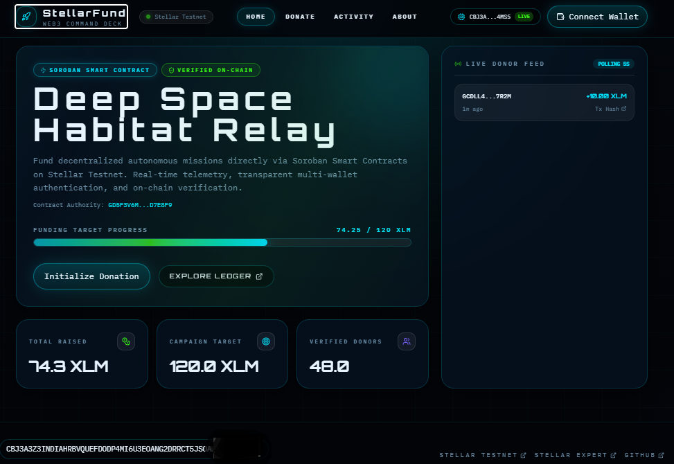
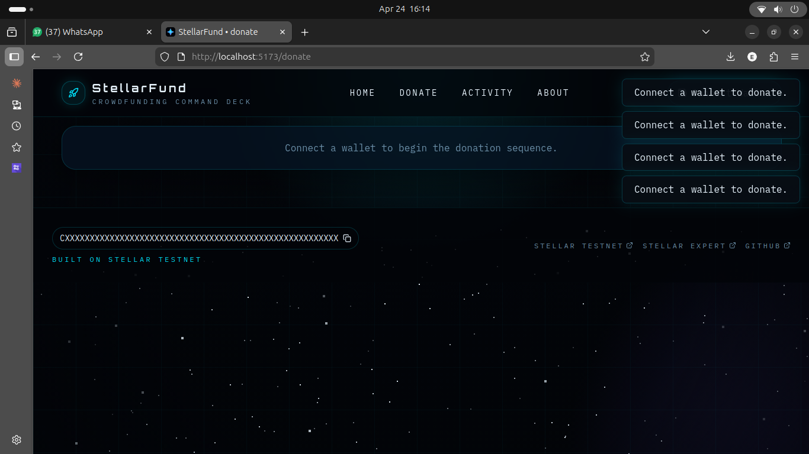
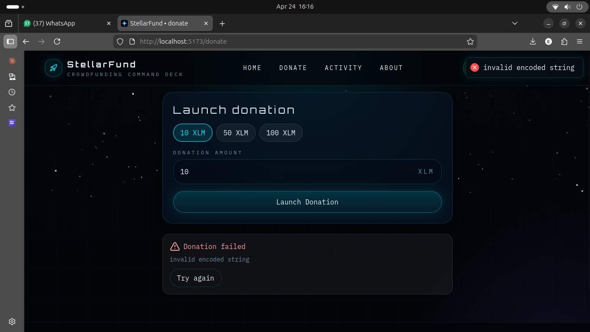

# StellarFund

[](https://stellar.org)
[](https://react.dev)
[](https://vitejs.dev)
[](https://tailwindcss.com)
[](https://soroban.stellar.org)

StellarFund is a futuristic Stellar Testnet crowdfunding dApp built with Soroban smart contracts, React 18, Vite 6, Tailwind CSS 4, Framer Motion, React Query, and the Stellar wallet kit.

The app includes animated page transitions, a deep-space HUD-style interface, live campaign stats, a donation flow with status states, and a live event feed. The frontend is designed to work with a deployed testnet contract, but it also falls back to demo data until you deploy and configure a real contract ID.

## Live Demo

[StellarFund Live Demo](https://stellar-crowdfund-phi.vercel.app/)

## Feature Matrix

| Feature | White Belt | Yellow Belt |
|---|---|---|
| Wallet support | Single wallet | Multi-wallet modal |
| Contract backend | None | Soroban smart contract |
| Donation state | Basic | Pending, confirming, success, error |
| Event feed | Static | Live polling every 5s |
| Error handling | Generic | 3 explicit error types |

## Tech Stack

Frontend:
- React 18
- Vite 6
- Tailwind CSS 4
- Framer Motion 12
- React Router 7
- React Query 5
- `@creit.tech/stellar-wallets-kit`
- `@stellar/stellar-sdk`
- `react-hot-toast`
- `lucide-react`

Contract:
- Rust stable
- Soroban SDK 21
- Stellar CLI 22

## Contract Details

Set these values after deploying the contract to Testnet:

| Field | Value |
|---|---|
| Contract ID | `VITE_CONTRACT_ID` |
| Network | Stellar Testnet |
| Soroban RPC | `https://soroban-testnet.stellar.org` |
| Horizon | `https://horizon-testnet.stellar.org` |

The frontend reads these from `frontend/.env`:

```bash
VITE_CONTRACT_ID=CXXXXXXXXXXXXXXXXXXXXXXXXXXXXXXXXXXXXXXXXXXXXXXXXXXXXXXX
VITE_SOROBAN_RPC=https://soroban-testnet.stellar.org
VITE_HORIZON=https://horizon-testnet.stellar.org
```

After you deploy the contract, copy the contract ID from the deploy output and paste it into `VITE_CONTRACT_ID`. The frontend uses demo data until that value is set.

## Error Handling

| Error type | Meaning |
|---|---|
| `WALLET_NOT_FOUND` | Wallet extension is missing or unavailable |
| `USER_REJECTED` | User rejected the wallet prompt |
| `INSUFFICIENT_BALANCE` | Wallet balance is too low for the donation |

## Project Structure

```text
stellar-crowdfund/
├── contract/
│   ├── Cargo.toml
│   └── src/lib.rs
├── frontend/
│   ├── index.html
│   ├── package.json
│   ├── public/favicon.svg
│   └── src/
│       ├── App.jsx
│       ├── main.jsx
│       ├── styles/globals.css
│       ├── components/
│       ├── hooks/
│       ├── lib/
│       └── pages/
└── readme.md
```

## Local Setup

### Frontend

```bash
cd frontend
npm install
npm run dev
```

### Contract

The contract source is ready in `contract/`, but this workspace does not include Rust or the Stellar CLI, so the build/deploy steps must be run on a machine with those tools installed.

Make sure `stellar` is the official Stellar/Soroban CLI before running contract commands. If `stellar --version` prints something like `SeqAn`, you have a different binary on your `PATH` and `stellar contract build` will fail with a misleading file-extension error.

```bash
rustup target add wasm32-unknown-unknown
cd contract
stellar contract --help
stellar contract build
stellar contract deploy --network testnet --source <SECRET_KEY>
stellar contract invoke --network testnet --id <CONTRACT_ID> -- init --owner <PUBLIC_KEY> --title "Deep Space Habitat Relay" --goal 1200000000
```

## How It Works

1. Connect a supported Stellar wallet from the top bar.
2. View live campaign metrics from the Soroban contract.
3. Submit a donation from the Donate page.
4. Watch the activity feed and stats refresh as contract events arrive.

## Screenshots

### Dashboard


### Wallet Connect Error State


### Donation Failed Error State


## Reviewer Notes

- The frontend currently falls back to demo data until a real contract ID is provided.
- The contract code is present and structured for Soroban deployment, but this environment cannot compile or deploy it because Rust and Stellar CLI are unavailable.
- Once deployed, update `frontend/.env` with the real contract ID and redeploy the frontend.

---

<!-- ## Commit History

| Commit | Description |
|---|---|
| `feat: add Soroban crowdfund contract` | Rust contract with `donate`, `get_campaign`, event emission |
| `feat: add StellarWalletsKit and contract client` | Multi-wallet modal, Soroban RPC calls, event polling |
| `feat: add campaign UI and donate form` | Progress bar, donation form, 3 error types, tx status |
| `docs: add README with contract address and tx hash` | Full setup docs and submission info | -->

---

## Testnet Info

This app runs entirely on **Stellar Testnet**. No real funds are used.

- Network: Stellar Testnet
- Horizon: `https://horizon-testnet.stellar.org`
- Soroban RPC: `https://soroban-testnet.stellar.org`
- Explorer: [stellar.expert/testnet](https://stellar.expert/explorer/testnet)

---

## License

MIT